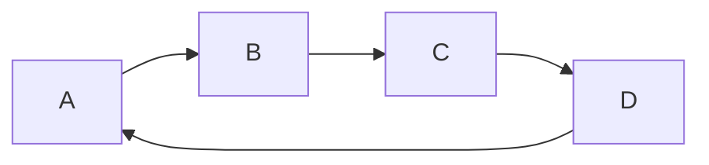

### MarkDown语法示例

- #### 表格样式：

  语法说明：

  不管是哪种方式，第一行为表头，第二行分隔表头和主体部分，第三行开始每一行为一个表格行。
  列于列之间用管道符|隔开。原生方式的表格每一行的两边也要有管道符。
  第二行还可以为不同的列指定对齐方向。默认为左对齐，在-右边加上:就右对齐。
   `-` 左对齐， `:-:` 中心对齐，`-:` 右对齐

| 表格  | 类型     | 描述（`源码中的竖线不用对齐也可以`）            |
| :-------------- | :--------: | --------: |
| 配置信息 | `Object` | [Configuration](123) 超链接样式 |

- #### 警示提醒

  ```
  !> 这里是警示语句（>后面有个空格）
  ```

  显示效果 ：

  !> 这里是警示语句.

- #### 提示语句

  ```
  > 这里是提示语句（>后面有个空格）
  ```

  显示效果：

  > 这里是提示语句

- #### 代码样式

  最上面一行和最下面一行各三个反向英文引号，中间写代码内容，最上面一行引号后可指定代码语言。

  效果如下：

  ```python
    try:
        r = requests.get(url,headers=headers)
    except:
        write_log(f'{url}网页请求失败')
        return None
    else:
        return r
  ```

- #### 任务列表

  Markdown语法：

  ```
  - [ ] 任务一 未做任务 `- + 空格 + [ ]`
  - [x] 任务二 已做任务 `- + 空格 + [x]`
  ```

  效果如下：

  - [ ] 任务一 未做任务 `- + 空格 + [ ]`

  - [x] 任务二 已做任务 `- + 空格 + [x]`

- #### 首行缩进

  不同特殊占位符所占空白是不一样大的。

  ```
  【1】 &emsp;或&#8195; //全角
  【2】 &ensp;或&#8194; //半角
  【3】 &nbsp;或&#160;  //半角之半角
  ```

- #### 换行

  由于markdown编辑器的不同,可能在一行字后面，直接换行回车，也能实现换行，但是在Visual Studio Code上，想要**换行必须得在一行字后面空两个格子才行**。


- #### 空行

  在编辑的时候有多少个空行(只要这一行只有回车或者space没有其他的字符就算空行)，在**渲染之后，只隔着一行**。

- #### 对齐方式

  ```
  <center>行中心对齐</center>
  <p align="left">行左对齐</p>
  <p align="right">行右对齐</p>
  ```

  显示效果：

  <center>行中心对齐</center>
  <p align="left">行左对齐</p>
  <p align="right">行右对齐</p>

- #### 字体样式

  ```
  *斜体*或_斜体_
  **粗体**
  ***加粗斜体***
  ~~删除线~~
  ++下划线++
  ==背景高亮==
  ```

  显示效果：

    *斜体*或_斜体_
  
    **粗体**
  
    ***加粗斜体***
  
	~~删除线~~
	
	++下划线++
	
	==背景高亮==

- #### 无序列表

  使用 *，+，- 表示无序列表。
  代码：

  ```
  * 无序列表项 一
  + 无序列表项 二
  - 无序列表项 三
  ```

  显示效果：

  * 无序列表项 一
  * 无序列表项 二
  * 无序列表项 三

- #### 有序列表

  有序列表则使用数字接着一个英文句点。

- #### 插入图像

  语法中图片Alt的意思是如果图片因为某些原因不能显示，就用定义的图片Alt文字来代替图片。 图片Title则和链接中的Title一样，表示鼠标悬停与图片上时出现的文字。 Alt 和 Title 都不是必须的，可以省略，但建议写上。

  Markdown 语法：

  ```
  <center>  <!--开始居中对齐-->
  
  
  格式: 
  </center> <!--结束居中对齐-->
  ```

  效果如下：居中格式`<center>`不能作用到图片上😓，待解决


- #### 转义字符

  Markdown中的转义字符为\，转义的有：

  \ 反斜杠 ` 反引号 * 星号 _ 下划线 {} 大括号 [] 中括号 () 小括号  # 井号 + 加号 - 减号 . 英文句号 ! 感叹号

- #### 字体、字号、颜色

  代码：

  ```
  <font face="黑体">我是黑体字</font>
  <font face="微软雅黑">我是微软雅黑</font>
  <font face="STCAIYUN">我是华文彩云</font>
  <font color=#0099ff size=12 face="黑体">黑体</font>
  <font color=gray size=5>gray</font>
  <font color=#00ffff size=3>null</font>
  ```

  显示效果：

  <font face="黑体">我是黑体字</font>
  
   <font face="微软雅黑">我是微软雅黑</font>
  
   <font face="STCAIYUN">我是华文彩云</font>
  
   <font color=#0099ff size=12 face="黑体">黑体</font>
  
   <font color=gray size=5>gray</font>
  
   <font color=#00ffff size=3>null</font>
  
- #### 分割线

  你可以在一行中用三个以上的星号、减号、底线来建立一个分隔线，行内不能有其他东西。你也可以在星号或是减号中间插入空格。下面每种写法都可以建立分隔线。

  代码：

  ```
  * * *
  ***
  *****
  - - -
  -----------
  ```

  * * *
  ***
  *****
  - - -
  -----------

- #### HTML原始代码

  在代码区块里面， & 、 < 和 > 会自动转成 HTML 实体，这样的方式让你非常容易使用 Markdown 插入范例用的 HTML 原始码，只需要复制贴上，剩下的 Markdown 都会帮你处理，

  代码：

  ```
  第一个例子：
  <div class="footer">
  © 2004 Foo Corporation
  </div>
  第二个例子：
  <center>
  
  <table>
  <tr>
  <th rowspan="2">值班人员</th>
  <th>星期一</th>
  <th>星期二</th>
  <th>星期三</th>
  </tr>
  <tr>
  <td>李强</td>
  <td>张明</td>
  <td>王平</td>
  </tr>
  </table>
  
  </center>
  ```

  显示效果：

  第一个例子：
   <div class="footer">
   © 2004 Foo Corporation
   </div>

  第二个例子：

  <center>

  <table> <tr> <th rowspan="2">值班人员</th> <th>星期一</th> <th>星期二</th> <th>星期三</th> </tr> <tr> <td>李强</td> <td>张明</td> <td>王平</td> </tr> </table>
</center>
  
- #### mermaid画图




作者：择势勤

链接：https://www.jianshu.com/p/ebe52d2d468f

来源：简书

著作权归作者所有。商业转载请联系作者获得授权，非商业转载请注明出处。
