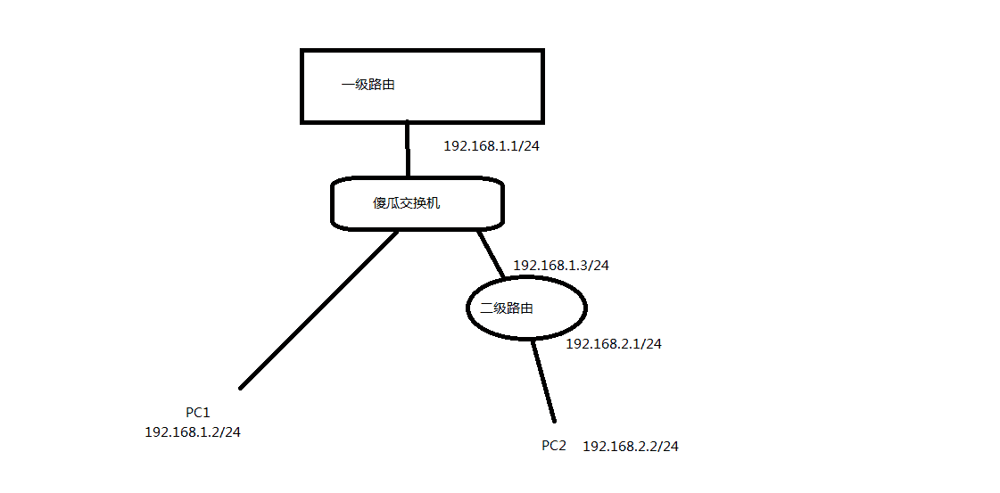

# 静态路由



**需求：要PC1可以访问二级路由的内网，比如PC2**

**设置方式**：

| 线路 | 目的地址    | 子网掩码      | 网关        |
| ---- | ----------- | ------------- | ----------- |
| LAN1 | 192.168.2.0 | 225.225.225.0 | 192.168.1.3 |

# MI-3路由器设置

1. 手动把要用的U盘格式化成ext4格式再插到路由器上，
2. 插上以后再在路由器里面格式化一次，

## 功能设置

### 扩展配置环境

启用 opt 自动更新   开启
启用 扩展脚本 自动更新   开启
opt 安装模式   安装到U盘
启用 MProxy 服务   开启    MProxy 允许 WAN 接入   开启    配置参数默认，不用改

### 搭建Web环境

启用 nginx+mysql+php 环境    开启
启用 MySQL 程序    允许远程访问
启用 默认主页 服务   允许远程访问
File Manager开关   开启

### USB应用程序

启用 FTP 服务器   开启
共享访问模式   账号允许    其他参数用默认的，不用改
手动添加FTP账号

### 防火墙设置

响应来自外网的 Ping 请求   开启
允许从互联网设置 MI-3    开启    端口自定
允许外网访问 FTP 服务器   开启   端口自定

### 外挂U盘设置(19-09-23版本好像识别到U盘后会自动把/opt挂载到U盘上)

把[Inodes]节点空间扩大，（8G的U盘我扩大为500K）

```bash
umount /dev/sdb1;		#sdb1是U盘上对应的分区
mkfs.ext4 -N 512000 /dev/sdb1;
```

然后在路由器管理界面把U盘挂载上。

>   改变Inodes节点空间大小会格式化磁盘，请提前做好数据备份。

最后把/opt挂载到U盘上

```bash
mount /dev/sdb1 /opt;
```

### h5ai设置指定目录访问权限（访问需要密码）

nginx中h5ai的配置文件路径是/opt/etc/nginx/vhost/h5ai.conf，但是修改它重启LNMP后会失效，修改的内容会丢失，不过好在h5ai.conf中有一条include /opt/etc/nginx/conf/php-fpm.conf，可以通过修改php-fpm.conf间接配置h5ai.conf。

在php-fpm.conf添加如下代码：

```nginx
location ~ ^/private/.* {
        auth_basic "please login";
        auth_basic_user_file /etc/nginx/.htpasswd;
        autoindex on;
    }
```

`~ ^/private/.*` 代表 private 目录访问需要密码，其他目录则不需要密码。/etc/nginx/.htpasswd是你的htpasswd文件路径

>   修改完php-fpm.conf文件后记得把opt自动更新关闭，不然重启路由器opt自动更新会覆盖该文件。

### Aliddns配置

替换正则代码为（不匹配100开头的IP地址）：

```c
'([0-9]+[1-9]\.)([0-9]+\.){2}[0-9]+'
```

