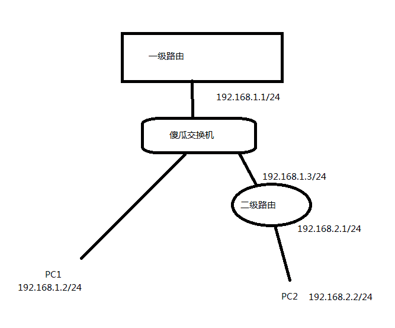

## 静态路由

**需求：要PC1可以访问二级路由的内网，比如PC2**

**设置方式**：

| 线路 | 目的地址    | 子网掩码      | 网关        |
| ---- | ----------- | ------------- | ----------- |
| LAN1 | 192.168.2.0 | 225.225.225.0 | 192.168.1.3 |

